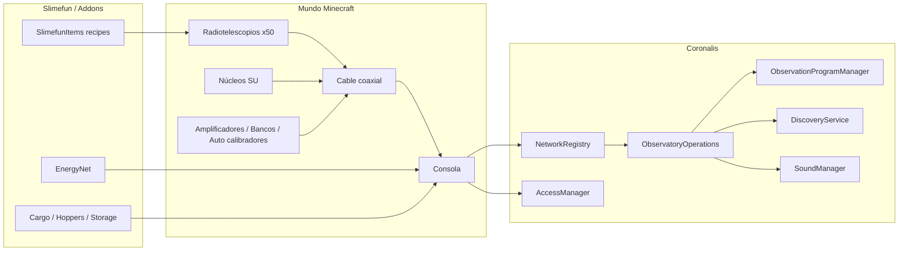

<h1 align="center">Coronalis</h1>

<p align="center">
  <strong>Addon Slimefun de radioastronomía, arrays cableados, telemetría y programas científicos</strong><br/>
  Un observatorio jugable para Paper 1.21.1 donde la energía, el cableado, la calibración y la señal importan.
</p>

<p align="center">
  <a href="https://github.com/JackStar6677-1/Coronalis"></a>
  
  
  
</p>

---

## Qué Es

**Coronalis** convierte una base Slimefun en un observatorio de radio interferometría. Construyes radiotelescopios, los conectas con cable coaxial, alimentas la consola con energía nativa o EnergyNet, calibras el array, apuntas a objetivos de cielo profundo y completas programas científicos con recompensas de XP.

La filosofía del plugin es que el observatorio sea una máquina real dentro de Minecraft: no basta con colocar bloques cerca. Hay red, carga energética, módulos, mantenimiento, telemetría, automatización y comandos de diagnóstico.

| Sistema | Qué aporta |
|---|---|
| Array cableado | Hasta 50 radiotelescopios conectados por bloques de cable |
| Energía dual | SU nativo de Coronalis y puente con Joules de Slimefun EnergyNet |
| Telemetría | Az/El, fase, amplitud, temperatura, corriente, fallos y PID |
| Ciencia | Objetivos celestes, eco de fase, baselines UV y programas científicos |
| Automatización | Entrada/salida compatible con cargo/hoppers/storage addons |
| Seguridad | Consolas protegibles por propietario, invitados y contraseña |

---

## Características

### Observatorio Cableado

- **Máximo de 50 radiotelescopios** por red para mantener rendimiento y balance.
- La red se reconstruye por conectividad de cable, no por proximidad suelta.
- Bloques principales:
  - `CORONALIS_COAXIAL_CABLE`
  - `CORONALIS_SIGNAL_CORE`
  - `CORONALIS_SIGNAL_AMPLIFIER`
  - `CORONALIS_DATA_BANK`
  - `CORONALIS_AUTO_CALIBRATOR`
  - `CORONALIS_RADIO_TELESCOPE`
  - `CORONALIS_CONTROL_CONSOLE`

### Energía y Compatibilidad Slimefun

- La consola es `EnergyNetComponent` y consume energía externa.
- Conversión interna: **4 J = 1 SU**.
- Buffer eléctrico de consola: **8192 J**.
- Importación por tick: **512 J/t**.
- Mantiene el loop nativo de Coronalis con SU, pero acepta redes de energía de otros addons compatibles.

### Automatización

- La consola implementa inventario compatible con transporte.
- El input automatizado acepta celdas de datos Coronalis para evitar atascar la máquina con ítems incorrectos.
- Las recetas usan componentes de Slimefun como circuitos, cables, motores, baterías, conectores de energía y placas reforzadas.

### Calibración y Telemetría

Cada radiotelescopio mantiene estado técnico:

- Error de azimut/elevación.
- Amplitud y fase de señal.
- Temperatura de motor y corriente.
- Estado runtime: `IDLE`, `SLEWING`, `TRACKING`, `FAULT`.
- Perfil PID ajustable.
- Contadores de reset y fallos inyectados.

### Programas Científicos

Los programas funcionan como misiones de observatorio: exigen tamaño de array, baselines, calibración, señal y módulos concretos.

| Programa | Requisitos destacados |
|---|---|
| `orion_molecular_map` | Primer mapa molecular, 4 antenas |
| `crab_synchrotron_watch` | Amplificador de señal y flujo estable |
| `andromeda_hi_survey` | Banco de datos y survey HI |
| `pulsar_timing_run` | Auto calibrador y fase estable |
| `sag_a_phase_lock` | Array grande contra Sagitario A* |
| `kepler_thermal_signature` | Señal débil con alto buffer |
| `m87_event_horizon_frame` | Emulación tipo EHT |
| `full_array_first_light` | Los 50 radiotelescopios, 1225 baselines y calibración casi perfecta |

### Terminal de Comandos

Coronalis incluye comandos para probar y diagnosticar sin depender siempre de testeo ingame manual.

```text
/coronalis help
/coronalis guide [energia|cableado|calibracion|automatizacion|programas]
/coronalis items
/coronalis status
/coronalis telemetry
/coronalis compare
/coronalis smoke
/coronalis move <az> <el>
/coronalis tune <preset|custom> [args]
/coronalis step <az> <el> [ticks]
/coronalis scan <spiral|wave|raster>
/coronalis dashboard
/coronalis maintenance [repair]
/coronalis export <json|csv>
/coronalis programs
/coronalis program <id|status|complete|clear>
/coronalis auth
```

### Seguridad de Consola

- Consola bloqueable por usuario.
- Invitaciones a otros jugadores.
- Autenticación por contraseña para instalaciones protegidas.
- Evita el enfoque de multijugador simultáneo global que podría introducir bugs de concurrencia a futuro.

---

## Flujo De Juego

1. Investiga los ítems de Coronalis en Slimefun.
2. Craftea una consola, radiotelescopios, cable coaxial y módulos.
3. Conecta todo por cable hasta formar una red válida.
4. Alimenta la consola con SU nativo, núcleos o energía externa EnergyNet.
5. Calibra el array y revisa telemetría.
6. Selecciona objetivo o programa científico.
7. Correlaciona señal, genera eco de fase y analiza recompensas.
8. Exporta telemetría o ejecuta maintenance si algo se calienta o falla.

---

## Arquitectura



---

## Requisitos

| Dependencia | Versión |
|---|---|
| Paper | 1.21.1 |
| Java | 21 |
| Slimefun 6 Drake / DrakesCraft-Labs | 11.x |
| Dough / dependencias Drake | Según servidor |

---

## Instalación

1. Compila o descarga `Coronalis.jar`.
2. Coloca el JAR en `plugins/` junto a Slimefun y Dough.
3. Reinicia el servidor.
4. Revisa `plugins/Coronalis/config.yml`.
5. Ejecuta `/coronalis help` y `/coronalis smoke`.

---

## Configuración

Fragmento relevante:

```yaml
discovery-xp:
  first_target_lock: 6
  tracking_lock: 10
  first_correlation: 25
  first_full_calibration: 18
  record_analysis: 200
  record_repeat: 40

  program_orion_molecular_map: 140
  program_crab_synchrotron_watch: 180
  program_andromeda_hi_survey: 220
  program_pulsar_timing_run: 300
  program_sag_a_phase_lock: 380
  program_kepler_thermal_signature: 520
  program_m87_event_horizon_frame: 700
  program_full_array_first_light: 1000

cosmic-events:
  chance-denominator: 3
  min-duration-seconds: 60
  max-duration-seconds: 180
```

---

## Build y Smoke

```powershell
cd C:\Users\pablo\Documentos\GitHub\Coronalis
mvn -DskipTests package
```

Salida:

```text
target/Coronalis.jar
```

Smoke local:

```powershell
powershell -NoProfile -ExecutionPolicy Bypass -File scripts\smoke.ps1 -SkipBuild
```

El smoke valida:

- JAR generado.
- `plugin.yml` y `config.yml` empaquetados.
- Comandos publicados.
- Clases principales empaquetadas.
- Compatibilidad EnergyNet/cargo.
- Telemetría, PID, maintenance, export y programas científicos.
- Recetas basadas en componentes Slimefun.

---

## Estructura

```text
Coronalis/
├── assets/
│   ├── hero.svg
│   └── banner-github-social.svg
├── docs/
├── scripts/
│   └── smoke.ps1
├── src/main/java/com/github/jackstar/coronalis/
│   ├── commands/
│   ├── discovery/
│   ├── implementation/
│   └── managers/
├── src/main/resources/
│   ├── config.yml
│   └── plugin.yml
├── pom.xml
├── README.md
└── CREDITS.md
```

---

## Créditos

- Autor: **[JackStar6677](https://github.com/JackStar6677-1)**
- Issues: [github.com/JackStar6677-1/Coronalis/issues](https://github.com/JackStar6677-1/Coronalis/issues)
- Marca y créditos: [CREDITS.md](CREDITS.md)
- Publicación GitHub: [docs/GITHUB_SETUP.md](docs/GITHUB_SETUP.md)

---

<p align="center">
  <em>Coronalis Array Labs: cablea el cielo, calibra la fase, escucha el vacío.</em>
</p>
